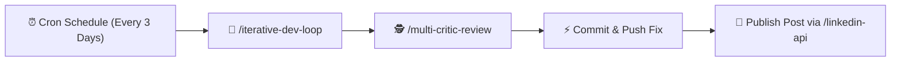

# 🗺️ 10-Post LinkedIn Content Roadmap: Junior ➔ Middle Engineering Path

> **Narrative Theme:** *«The Engineering Growth Path: Real production bugs, why naive Junior code breaks at scale, and how to engineer resilient Middle/Senior systems.»*  
> **Source Codebase:** [Asm-o-Dan/DrugsEngine](https://github.com/Asm-o-Dan/DrugsEngine) & [Asm-o-Dan/DrugsEnginePythonService](https://github.com/Asm-o-Dan/DrugsEnginePythonService)

---

```mermaid
journey
    title 10-Stage Junior to Middle Engineering Evolution
    section Level 1: Syntax & Validation
      #1: The Unicode Ё Trap & Culture Parsing: 5: Junior
      #2: The Self-Breaking PUT Handler: 5: Junior
      #3: Undefined Symbol Crash on Kafka EOF: 4: Junior
    section Level 2: Contracts & Microservices
      #4: Vectorizing JSON String vs Query: 4: Junior+
      #5: Ghost UUIDs & Entity Deserialization: 3: Junior+
      #6: Socket Starvation & Recursive Retries: 3: Middle-
    section Level 3: Concurrency & State
      #7: Static State Race Conditions: 2: Middle
      #8: Dirty EF Core ChangeTracker on Rollback: 2: Middle
      #9: The 10-Second Ephemeral Kafka Producer: 1: Middle
      #10: Ingestion N+1 Storm & GUID Misalignment: 1: Middle+
```

---

## 📅 Roadmap Overview (Sorted from Simple to Complex)

| # | Topic | File & Line Reference | Anti-Pattern / Root Cause | Production Solution |
|---|---|---|---|---|
| **1** | **The Unicode `Ё` Trap & Invariant Culture** | `Domain/Validators/DrugValidator.cs:20`<br/>`Infrastructure/Parsing/VivaFarmParser.cs:136` | `[А-Яа-я]` regex range excludes `Ё`/`ё` (Unicode 1025/1105); float string parse depends on OS locale | Explicit `[А-Яа-яЁё]` ranges + `CultureInfo.InvariantCulture` |
| **2** | **The Self-Breaking `PUT` Controller** | `Infrastructure/API/Controllers/DrugController.cs:65-70` | Instantiating entity generates a fresh `Guid.NewGuid()`, making `id != command.Drug.Id` always true | Entity factory method accepting route ID or DTO mutation model |
| **3** | **Undefined Symbol Crash on Kafka EOF** | `pythonProject2/app/mq/kafka_consumer.py:1,132` | Referencing `KafkaError._PARTITION_EOF` without importing `KafkaError`, crashing on broker EOF | Proper import & typed exception handling in event loop |
| **4** | **Serializing Serialization: Vectorizing JSON** | `pythonProject2/app/mq/rabbit_consumer.py:67,103` | Passing raw decoded JSON string into `vectorize_text()` instead of parsing query payload | Schema validation via Pydantic + extracting target payload text |
| **5** | **Ghost UUIDs & Broken Microservice Contracts** | `pythonProject2/app/Classes/classes.py:27-34` | Deserializer drops incoming PostgreSQL `Id` and creates random UUIDs, desynchronizing Qdrant | Relational ID preservation across event streams |
| **6** | **Socket Starvation & Infinite Recursion in HTTP** | `Infrastructure/Parsing/BaseParser.cs:14-22` | `new RestClient()` inside method + recursive self-calls on failure causing port exhaustion & OOM | `IHttpClientFactory` / Singleton client + Polly retry policy with backoff |
| **7** | **Static Mutable Dictionaries in Domain Entities** | `Domain/Validators/Primitives/ExistingDrugStoreNumbers.cs:5`<br/>`Domain/Entities/DrugStore.cs:24-31` | Enforcing unique constraint via static `Dictionary` causing thread race collisions and memory leaks | Database unique constraints + transactional repository queries |
| **8** | **Dirty EF Core ChangeTracker on Rollback** | `Infrastructure/Dal/UnitOfWork.cs:41-57` | Rolling back transaction leaves entities in `Added`/`Modified` state inside `ChangeTracker` | `_dbContext.ChangeTracker.Clear()` inside rollback handlers |
| **9** | **The 10-Second Ephemeral Kafka Producer** | `Infrastructure/Kafka/KafkaProducer.cs:37-56` | Rebuilding librdkafka producer per message + synchronous `Flush(10s)` blocking request threads | Singleton `IProducer<Null, string>` + non-blocking `ProduceAsync` |
| **10** | **The Ingestion N+1 Storm & Premature Lookups** | `Infrastructure/Parsing/ParsingManager.cs:130`<br/>`Application/UseCases/Commands/DrugItemCommands/CreateOrUpdateDrugItemCommandHandler.cs:28` | Pre-querying foreign keys before resolving them + executing 5N DB transactions per scraping run | Batch ingestion with in-memory hash maps + EF Core `AddRangeAsync` |

---

## 📝 Detailed Post Blueprints

---

### 📌 Post 1: The Unicode `Ё` Trap & Invariant Culture Parsing
- **Hook Options:**
  - *«Why did our parser silently drop 14% of medication names? Because of one letter: `Ё`.»*
  - *«The classic Junior regex bug that breaks in Russian and crashes on Linux Docker:»*
- **Junior Approach:** Using `^[А-Яа-я]+$` assuming Russian alphabet is contiguous in Unicode.
- **The Failure:** `Ё` is code point 1025, while `А-Я` is 1040–1071. All medicines with "Щёлково" or "Зелёная" fail validation.
- **The Fix:** Using `[А-Яа-яЁё]` and explicit `CultureInfo.InvariantCulture` for float parsing.
- **Hashtags:** `#dotnet #csharp #regex #cleancode #unicode #backend`

---

### 📌 Post 2: The Self-Breaking `PUT` Controller
- **Hook Options:**
  - *«Our API returned 400 Bad Request on 100% of update calls. Here is the 3-line logic flaw:»*
  - *«Entity constructors that generate default GUIDs can silently break your REST API.»*
- **Junior Approach:** Instantiating `new Drug(name, ...)` in the controller for an update request, expecting it to represent the target record.
- **The Failure:** `BaseEntity` generates a fresh `Guid.NewGuid()`. The check `if (id != command.Drug.Id)` is always true.
- **The Fix:** Separating Create vs Update DTO models and passing route parameters explicitly.
- **Hashtags:** `#dotnet #restapi #aspnetcore #csharp #webapi #softwareengineering`

---

### 📌 Post 3: Undefined Symbol Crash in Kafka Event Loops
- **Hook Options:**
  - *«A single unimported enum crashed our Python consumer service every time Kafka hit partition EOF.»*
  - *«Dynamic typing in Python is great — until an error handler crashes on a missing import.»*
- **Junior Approach:** Writing exception handling code that references `KafkaError._PARTITION_EOF` without linting or test coverage.
- **The Failure:** When EOF occurs, `NameError: name 'KafkaError' is not defined` kills the container process.
- **The Fix:** Strict Ruff/Flake8 linting, explicit imports, and typed exception handlers.
- **Hashtags:** `#python #apachekafka #microservices #eventdriven #devops`

---

### 📌 Post 4: Serializing Serialization (Vectorizing Raw JSON Strings)
- **Hook Options:**
  - *«We wondered why semantic search for 'Aspirin' was matching random vitamins. Then we inspected the vector payload.»*
  - *«When your AI model embeds JSON syntax instead of user queries:»*
- **Junior Approach:** Reading message body as raw text `body.decode('utf-8')` and passing directly into `vectorize_text()`.
- **The Failure:** LaBSE model calculates embeddings for `{"text": "Aspirin", "timestamp": "2026-08-16"}`, skewing vector similarity.
- **The Fix:** Explicit Pydantic parsing and schema contracts between .NET and Python services.
- **Hashtags:** `#ai #nlp #vectorsearch #qdrant #python #microservices`

---

### 📌 Post 5: Ghost UUIDs & Desynchronized Vector Databases
- **Hook Options:**
  - *«What happens when your PostgreSQL database and Qdrant vector index use completely different IDs for the same drug?»*
  - *«The silent dataclass bug that broke relational integrity across our AI services:»*
- **Junior Approach:** Using `id: str = field(default_factory=lambda: str(uuid.uuid4()))` in the consumer DTO.
- **The Failure:** Kafka message contains PostgreSQL `Id`, but deserializer ignores it and generates new IDs.
- **The Fix:** Mandatory identity mapping in event serialization contracts.
- **Hashtags:** `#vectordatabase #qdrant #postgresql #architecture #distributed`

---

### 📌 Post 6: Socket Starvation & Infinite Recursion in HTTP Scraping
- **Hook Options:**
  - *«It worked on 10 pages. It crashed on 10,000. How `new RestClient()` exhausted our OS ports in 2 minutes:»*
  - *«Why recursion is an anti-pattern for HTTP retry policies in .NET:»*
- **Junior Approach:** `var client = new RestClient()` inside method + recursive call on `!response.IsSuccessful`.
- **The Failure:** TCP ports stuck in `TIME_WAIT` + 404 links cause stack overflows.
- **The Fix:** `IHttpClientFactory` + Polly exponential backoff with max 3 attempts and `CancellationToken`.
- **Hashtags:** `#dotnet #csharp #networking #webscraping #resilience`

---

### 📌 Post 7: Static Mutable State & Concurrency Race Conditions
- **Hook Options:**
  - *«Enforcing uniqueness in memory using static Dictionaries: Why this Junior shortcut breaks in production.»*
  - *«We ran our ingestion with 4 threads and corrupted our internal dictionary state.»*
- **Junior Approach:** `public static Dictionary<string, HashSet<int>> DrugStoreNumbers` inside Domain layer.
- **The Failure:** Unsynchronized multithreaded writes cause hash collision infinite loops and cross-request state pollution.
- **The Fix:** Stateless domain entities + database unique constraints.
- **Hashtags:** `#concurrency #csharp #dotnet #threading #cleanarchitecture`

---

### 📌 Post 8: Dirty EF Core ChangeTracker on Transaction Rollback
- **Hook Options:**
  - *«Why EF Core will try to re-save broken entities even AFTER you roll back your transaction:»*
  - *«The hidden gotcha of `IDbContextTransaction.RollbackAsync()`:»*
- **Junior Approach:** Catching exception, rolling back transaction, and expecting DbContext to be clean.
- **The Failure:** `ChangeTracker` retains entities in `Added`/`Modified` state. On subsequent operations, EF Core throws duplicate key exceptions.
- **The Fix:** Calling `_dbContext.ChangeTracker.Clear()` upon rollback.
- **Hashtags:** `#entityframework #efcore #dotnet #postgresql #databases`

---

### 📌 Post 9: Ephemeral Kafka Producers & 10-Second Flush Latency
- **Hook Options:**
  - *«We turned Apache Kafka into a synchronous 10-second bottleneck by using it like a short-lived DB connection.»*
  - *«Why `using var producer = Build()` is the worst way to produce Kafka messages in .NET:»*
- **Junior Approach:** Creating and disposing `ProducerBuilder` per message + calling `producer.Flush()`.
- **The Failure:** High CPU, thread creation overhead, and complete loss of Kafka batching.
- **The Fix:** Singleton `IProducer<Null, string>` + asynchronous fire-and-forget / acknowledgement callbacks.
- **Hashtags:** `#kafka #eventdriven #dotnet #highload #distributed`

---

### 📌 Post 10: The Ingestion N+1 Storm & Premature Lookups
- **Hook Options:**
  - *«How we turned a 2-hour scraping job into a 45-second batch import.»*
  - *«The ultimate Clean Architecture anti-pattern: Calling MediatR commands inside a sequential foreach loop.»*
- **Junior Approach:** Iterating 2,000 parsed items, opening a new transaction and running 5 individual queries for each item.
- **The Failure:** 12,000 roundtrips to PostgreSQL for a single pharmacy catalog.
- **The Fix:** Batch ingestion pipeline with in-memory dictionary cache + bulk upserts.
- **Hashtags:** `#performance #highload #sql #dotnet #systemdesign`

---

## 🤖 Automated Publishing Pipeline Workflow


